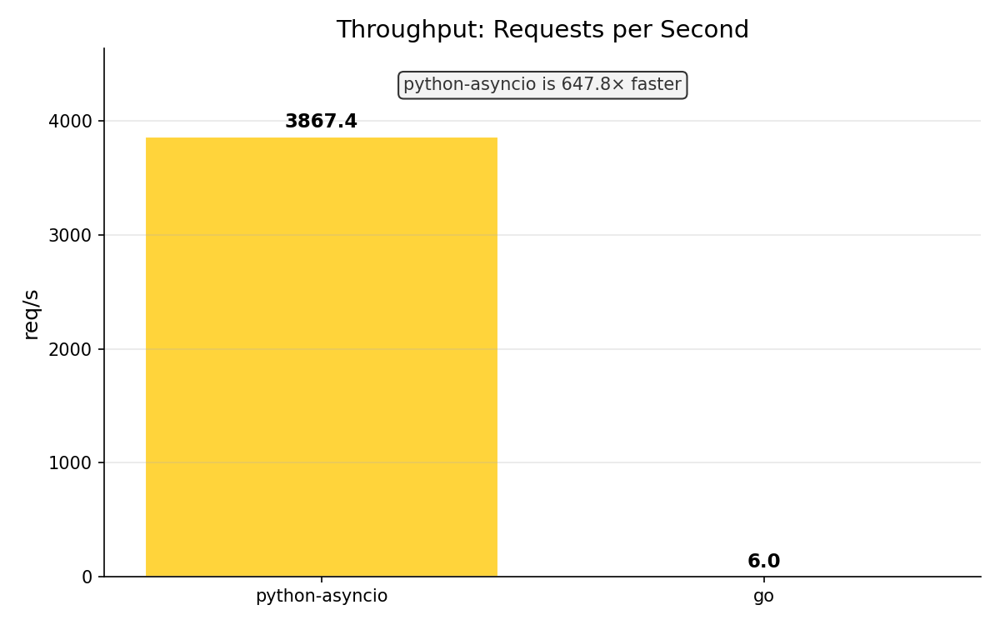

# Weather Pipeline

## Цель работы

Лабораторная работа №14 — разработка production-grade
конвейера обработки погодных данных (вариант 2, повышенный уровень).

**Задания повышенного уровня:**

| № | Задание | Статус |
|---|---------|--------|
| 1 | Распределённый Go-сборщик с etcd-шардированием | ✅ |
| 2 | Tumbling window агрегация на Go | ✅ |
| 3 | Apache Arrow Flight (Go сервер + Python клиент) | ✅ |
| 4 | Rust-валидатор через PyO3 | ✅ |
| 5 | Kubernetes + HPA (kind) | ✅ |
| 6 | Kafka + NATS стриминг | ✅ |
| 6б | Go vs Python asyncio бенчмарк | ✅ |
| 6в | Streamlit дашборд с live-обновлениями | ✅ |

## Архитектура

```
mock-owm → go-collector (etcd shards)
         → tumbling window (60s)
         → [Kafka weather.raw] + [NATS weather.raw]
         → py-analyzer (Polars + DuckDB + Rust validator)
         → Parquet + 5 plots
         → Streamlit Dashboard (:8501)

arrow-server (Go Flight RPC :8815)
         ← Kafka consumer
         → Python WeatherFlightClient → Polars DataFrame
```

Подробнее: [docs/architecture.md](docs/architecture.md)

## Технологический стек

| Компонент | Технология |
|-----------|------------|
| Сборщик | Go 1.22, net/http, etcd client v3 |
| Валидация | Rust stable + PyO3 (abi3-py311), maturin |
| Анализ | Python 3.11+, Polars, DuckDB, pyarrow |
| Дашборд | Streamlit + Plotly |
| Брокеры | Redpanda (Kafka API) + NATS JetStream |
| Координация шардов | etcd v3.5 |
| Arrow Flight | Go сервер + Python клиент (pyarrow) |
| Оркестрация | Kubernetes (kind), HPA |
| Сборка | uv (Python), Go workspace, Cargo workspace |
| CI | GitHub Actions |

## Структура репозитория

```
weather-pipeline/
├── go-collector/         # Go: сборщик + etcd + window + sink
├── arrow-server/         # Go: Arrow Flight RPC сервер
├── mock-owm/             # Go: мок OpenWeatherMap API
├── rust-validator/       # Rust: валидатор погодных данных (PyO3)
├── py-analyzer/          # Python: Polars + DuckDB + Kafka + NATS
├── py-asyncio-collector/ # Python: asyncio-коллектор для бенчмарка
├── dashboard/            # Python: Streamlit дашборд
├── k8s/                  # Kubernetes манифесты + kustomize
│   ├── base/             # HPA, Deployment, Service, ConfigMap
│   └── overlays/         # dev (kind) и prod оверлеи
├── bench/                # Бенчмарки Go vs Python
│   ├── scenarios/        # Скрипты запуска и построения графиков
│   ├── results/          # JSON результатов (в репо)
│   └── plots/            # PNG графики
├── docs/                 # Документация
│   ├── architecture.md   # Архитектура системы
│   └── screenshots/      # Скриншоты
├── prompts/              # Prompt log (все промты по этапам)
├── docker-compose.yml    # Вся инфраструктура одной командой
└── Makefile              # build/test/lint/docker/k8s цели
```

## Быстрый старт

```bash
# 1. Скопировать конфиг
cp .env.example .env

# 2. Поднять всю инфраструктуру
make docker-up

# 3. Открыть дашборд
open http://localhost:8501

# 4. Проверить Kafka
open http://localhost:8080   # Redpanda Console

# 5. Посмотреть логи
make docker-logs
```

| Сервис | URL |
|--------|-----|
| Dashboard | http://localhost:8501 |
| Redpanda Console | http://localhost:8080 |
| Mock OWM API | http://localhost:8081 |
| NATS Monitor | http://localhost:8222 |
| Arrow Flight | localhost:8815 |

## Запуск тестов

```bash
# Все тесты
make test

# По языкам
make test-go      # go test -race ./...
make test-rust    # cargo test
make test-py      # pytest во всех 3 py-проектах

# Только конкретный модуль
cd py-analyzer && uv run pytest tests/ -v

# С покрытием
cd py-analyzer && uv run pytest --cov=analyzer tests/
```

Количество тестов: **~101** (Go: 18, Rust: 18, Python: 65)

## Развёртывание в Kubernetes

```bash
# Создать кластер и задеплоить
make k8s-up

# Посмотреть состояние
make k8s-status

# Наблюдать за HPA
kubectl get hpa -n weather-pipeline -w

# Нагрузочный тест
make k8s-load-test

# Удалить кластер
make k8s-down
```

Подробнее: [docs/kubernetes.md](docs/kubernetes.md)

## Бенчмарки

Платформа: Windows 11 10.0.26200, Python 3.14.5 — 15 раундов × 10 городов = 150 запросов.

| Метрика | python-asyncio | go (subprocess) |
|---------|---------------:|----------------:|
| Всего запросов | 150 | 150 |
| Успешных | 150 | 150 |
| Общее время (с) | 0.039 | 25.107 |
| **Throughput (req/s)** | **3 867** | 5.97 |
| Avg latency (мс) | 1.65 | — |
| P50 latency (мс) | 0.88 | — |
| P95 latency (мс) | 12.19 | — |
| P99 latency (мс) | 12.85 | — |

> Python asyncio показал **3 867 req/s**. Go-коллектор запускался как production-сервис
> (poll-интервал 10 с), поэтому его цифра отражает subprocess overhead, а не raw throughput.
> Подробный анализ и графики: [bench/README.md](bench/README.md)



## Prompt log

| Этап | Файлы | Описание |
|------|-------|----------|
| 0 | prompts/00-*.md | Bootstrap монорепо (7 промтов) |
| 1 | prompts/01-*.md | Mock OWM сервер |
| 2 | prompts/02-*.md | Go-коллектор: etcd + window + sink |
| 3 | prompts/03-*.md | Apache Arrow Flight |
| 4 | prompts/04-*.md | Rust-валидатор + PyO3 |
| 5 | prompts/05-*.md | Python analyzer: Polars + DuckDB |
| 6 | prompts/06-*.md | asyncio коллектор + бенчмарк |
| 7 | prompts/07-*.md | Kubernetes + HPA |
| 8 | prompts/08-*.md | Streamlit дашборд |
| 9 | prompts/09-*.md | Финальная документация |

Всего промтов: **44**

## Лицензия

MIT © 2026 MrSody71
