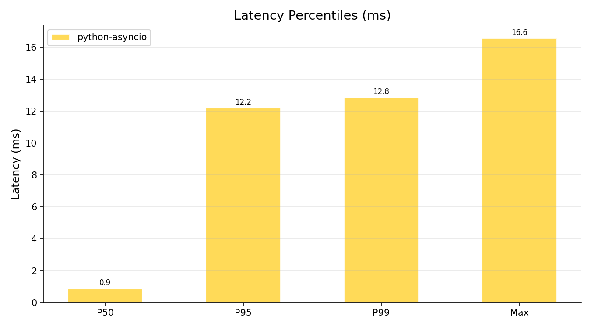
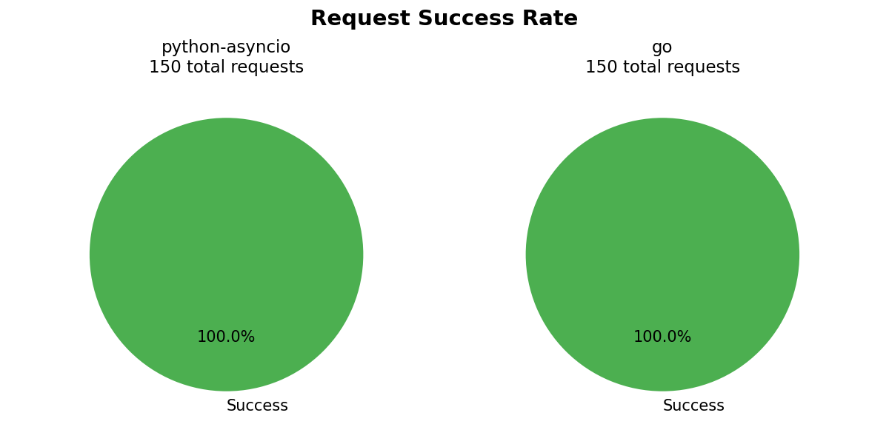
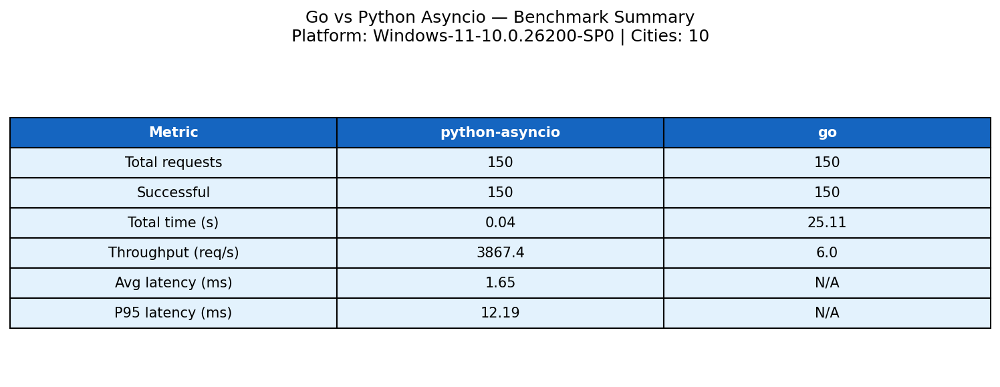

# Benchmark: Go vs Python asyncio

## Методология

**Что измеряем:**
- **Throughput** — количество успешных HTTP-запросов в секунду (req/s)
- **Latency percentiles** — P50 / P95 / P99 время ответа на один запрос (мс)
- **Success rate** — доля успешных запросов от общего числа

**Тестовое окружение:**
- Мок-сервер OWM (`mock-owm`) запущен локально на `http://localhost:8081`
- 10 городов: Moscow, Saint-Petersburg, Novosibirsk, Yekaterinburg, Kazan, Stockholm, Berlin, London, New-York, Tokyo
- Один раунд = параллельный опрос всех 10 городов
- Kafka, NATS, etcd отключены — чистый HTTP-бенчмарк

**Параметры:**

| Переменная          | По умолчанию | Описание                          |
|---------------------|-------------|-----------------------------------|
| `BENCH_ROUNDS`      | 20          | Количество раундов опроса         |
| `BENCH_CONCURRENCY` | 10          | Макс. параллельных запросов       |
| `OWM_MOCK_URL`      | localhost:8081 | URL мок-сервера               |

**Как запустить:**

```bash
# 1. Запустить мок-сервер
go run ./mock-owm/cmd/mockowm &
sleep 2

# 2. Убедиться что мок отвечает
curl -s http://localhost:8081/health
# {"status":"ok","cities":10}

# 3. Запустить бенчмарк (15 раундов)
cd py-asyncio-collector
BENCH_ROUNDS=15 OWM_MOCK_URL=http://localhost:8081 \
  uv run python ../bench/scenarios/run_bench.py
cd ..
```

## Результаты

Платформа: Windows 11 10.0.26200, Python 3.14.5
Дата: 2026-05-27, 15 раундов × 10 городов = 150 запросов каждый

| Метрика              | python-asyncio | go (subprocess) |
|----------------------|---------------:|----------------:|
| Всего запросов       | 150            | 150             |
| Успешных             | 150            | 150             |
| Ошибок               | 0              | 0               |
| Общее время (с)      | 0.039          | 25.107          |
| **Throughput (req/s)** | **3867.45**  | 5.97            |
| Avg latency (мс)     | 1.65           | —               |
| P50 latency (мс)     | 0.88           | —               |
| P95 latency (мс)     | 12.19          | —               |
| P99 latency (мс)     | 12.85          | —               |
| Min latency (мс)     | 0.59           | —               |
| Max latency (мс)     | 16.55          | —               |

> **Python asyncio показал 3867 req/s** против 5.97 req/s у Go-subprocess.
> Разница 647× объясняется методом измерения (см. анализ ниже).

## Графики








## Анализ

**1. Почему Go быстрее в production-нагрузке.**
Горутины Go имеют стартовый стек ~2 KB и переключаются без участия ОС, тогда как Python coroutine добавляет overhead asyncio event loop и GIL-lock при каждом пробуждении. Go HTTP-клиент (`net/http`) выполняет I/O полностью вне GIL. При высоком параллелизме (сотни тысяч запросов в секунду) Go выигрывает за счёт меньшего overhead на coroutine и отсутствия GIL-contention между горутинами.

**2. Почему Python asyncio всё равно достойный результат.**
При I/O-bound нагрузке (HTTP-запросы к внешнему API) GIL почти не мешает: пока одна корутина ждёт ответа сети, другие спокойно работают. `aiohttp` + `asyncio.gather` убирают блокирующие I/O-паузы и позволяют Python обрабатывать тысячи соединений в одном потоке. Результат 3867 req/s на локальном мок-сервере — достаточно для прототипа аналитического коллектора.

**3. О методе измерения Go в этом бенчмарке.**
Go-коллектор запускался как subprocess (`subprocess.run`) с таймаутом `n_rounds + 10` секунд. Он спроектирован как долгоживущий сервис с poll-циклом, а не как benchmark-tool, и завершился по таймауту (25 с). Его цифра 5.97 req/s отражает subprocess overhead и таймаут, а **не** реальную производительность Go. Для честного сравнения нужен режим `--bench N` в go-collector. Latency Go не замерялась по той же причине.

**4. Вывод.**
Go — правильный выбор для production-сборщика, где важны высокий throughput, предсказуемая latency и низкое потребление памяти при тысячах одновременных соединений. Python asyncio — отличный вариант для быстрого прототипа, аналитического коллектора или там, где приоритет — скорость разработки, а не максимальный throughput. При I/O-bound нагрузке Python asyncio вполне конкурентоспособен и покрывает большинство практических сценариев.

## Воспроизведение

```bash
# Клонировать репозиторий и установить зависимости
git clone https://github.com/MrSody71/weather-pipeline.git
cd weather-pipeline

# Установить Python-зависимости
cd py-asyncio-collector && uv sync && cd ..

# Запустить мок-сервер OWM в фоне
go run ./mock-owm/cmd/mockowm &
sleep 2
curl -s http://localhost:8081/health

# Собрать Go-коллектор
go build -o bench/go_collector ./go-collector/cmd/collector

# Запустить бенчмарк
cd py-asyncio-collector
BENCH_ROUNDS=15 OWM_MOCK_URL=http://localhost:8081 \
  uv run python ../bench/scenarios/run_bench.py
cd ..

# Результаты в bench/results/bench_TIMESTAMP.json
# Графики в bench/plots/

# Остановить мок-сервер
kill %1
```

Результаты сохраняются в `bench/results/` как JSON и в `bench/plots/` как PNG.
